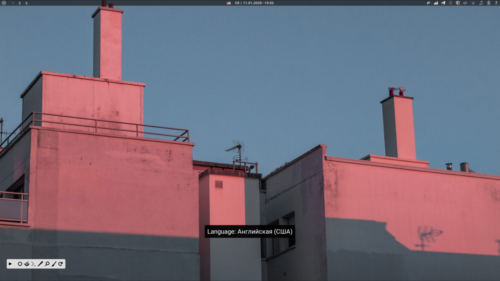

# Cinnamon-Keyboard-Applet



Этот измененный стандартный апплет для Cinnamon (keyboard@cinnamon.org) добавляет всплывающее уведомление, которое показывает текущий язык раскладки клавиатуры в центре экрана. Это удобно для пользователей, которые часто переключаются между несколькими языками ввода. Вдохновением послужила аналогичная функция в KDE Plasma.

## Особенности

- Отображение текущего языка раскладки клавиатуры в центре экрана.
- Возможность настройки текстового префикса и отступов для уведомления.

## Установка

### Через Git

1. Клонируйте репозиторий:

```bash
git clone https://github.com/morington/Cinnamon-Keyboard-Applet.git
```

2. Перейдите в директорию с клонированным репозиторием:

```bash
cd Cinnamon-Keyboard-Applet
```

3. Перенесите директорию `keyboard@morington.org` в `applets`:

```bash
mv keyboard@morington.org ~/.local/share/cinnamon/applets/
```

### Ручная установка 

1. Скачайте архив репозитория и распакуйте его.
2. Переместите папку `keyboard@morington.org` в директорию `~/.local/share/cinnamon/applets/`

**После установки перезапустите Cinnamon (можно сделать через команду `Alt + F2`, затем ввести `r` и нажать `Enter`).**

### Настройка 

После установки вы можете настроить апплет через интерфейс настроек Cinnamon: 

1. Правый клик на панели -> "Настройки апплетов".
2. Найдите и выберите апплет "Keyboard" (или "Keyboard @ morington.org").
3. Настройте следующие параметры:
    - `Language Prefix` : Префикс текста уведомления (по умолчанию "Language: ").
    - `Margin Width` : Горизонтальное смещение уведомления (в пикселях).
    - `Margin Height` : Вертикальное смещение уведомления (в пикселях).

### Дополнительно

Чтобы не искать где лежат иконки, они расположены здесь:
```js
const getFlagFileName = name => `/usr/share/iso-flag-png/${name}.png`;
```
К примеру: `/usr/share/iso-flag-png/ru.png`. Можно менять их самостоятельно, просто загрузите нужный `png`.

### Лицензия 

Этот проект распространяется под лицензией **MIT License**. Подробнее о лицензии можно узнать в файле `LICENSE`.

### Благодарности 

Благодарю сообщество Cinnamon за создание отличной среды рабочего стола и всех тех, кто помогал в разработке этого апплета.


